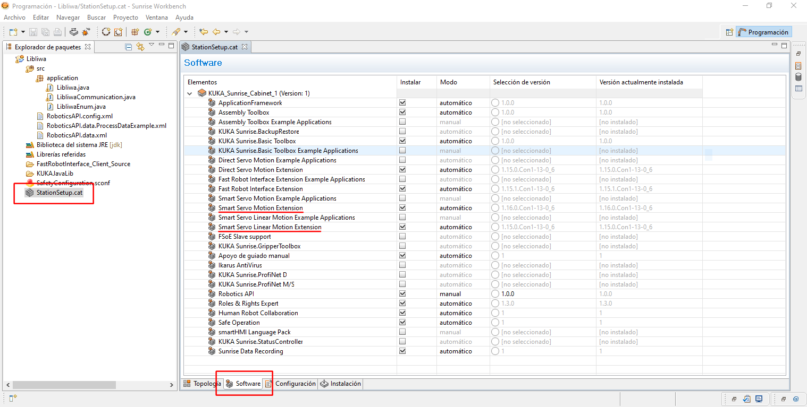
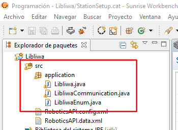
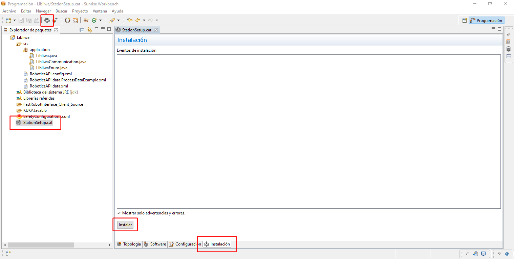

Installation
============

.. |_| unicode:: 0xA0 
    :trim:

.. contents:: Table of Contents
   :depth: 3
   :local:
   :backlinks: none

.. raw:: html
  
    

    

Requirements
------------

**Hardware:**

- `KUKA LBR iiwa <https://www.kuka.com/en-us/products/robotics-systems/industrial-robots/lbr-iiwa>`_ cobot
- `KUKA Sunrise Cabinet <https://www.kuka.com/en-us/products/robotics-systems/robot-controllers/kuka-sunrise-cabinet>`_ (controller for KUKA's LBR iiwa cobot)
- External workstation (Linux or Windows)

**Software:**

- `KUKA Sunrise.Workbench <https://my.kuka.com/s/category/software/engineering-for-robot-systems/sunrise-workbench-series/0ZG1i000000XaaaGAC>`_ for creating and synchronizing Sunrise projects
- `KUKA Sunrise.Servoing <https://my.kuka.com/s/category/software/system-software-expansion/kuka-sunrise-extensions-series/product-family-kuka-sunriseservoing/0ZG1i000000XapCGAS?language=en_US>`_ extension

.. raw:: html

    

Installation and setup
----------------------

The installation and setup is divided into two parts:

- The **Sunrise project** to be installed in the KUKA Sunrise Cabinet (programmed in JAVA) 
- The **external packages** that communicates with the Cabinet via TCP/IP

.. raw:: html

    

.. _sunrise_project:

Sunrise project
^^^^^^^^^^^^^^^

1. In the Sunrise.Workbench, create a new project or load the existing project from the controller (default IP: :literal:`172.31.1.147`)

2. Open the :literal:`StationSetup.cat` file and enable **SmartServo** extensions (in the :literal:`Software` tab)

3. Copy library files (:literal:`.java` files) from :literal:`libiiwa/java/src/application` to :literal:`<sunrise_project>/src/application` folder

4. Edit the ProcessData configuration (:literal:`<sunrise_project>/src/RoboticsAPI.data.xml` file) and overwrite the content with the following configuration

.. tabs::

    .. tab:: Common environment

        .. literalinclude:: ../../../java/src/RoboticsAPI.data.xml
            :language: xml

.. raw:: html

     

.. list-table::
    :header-rows: 1

    * - Data
      - Default
      - Description
    * - Communication: Use double precision
      - :literal:`false`
      - Whether\ |_| \to\ |_| \use\ |_| \double\ |_| \precision\ |_| \(64\ |_| \bits) in both the request and the response (default: float precision (32 bits))
    * - Controller: IP Address
      - :literal:`172.31.1.25`
      - External\ |_| \control\ |_| \workstation\ |_| \IP\ |_| \address
    * - Controller: Port
      - :literal:`12225`
      - External control workstation port
    * - Log to SmartPad: Info
      - :literal:`false`
      - Whether to display information about received commands or any other data on the smartHMI. **The excessive use of the message display could degrade the application performance and the smartHMI operation**
    * - Log to SmartPad: Warning
      - :literal:`true`
      - Whether to display warning messages on the smartHMI. **The excessive use of the message display could degrade the application performance and the smartHMI operation**
    * - Robot: Tools
      - :literal:`""`
      - List of tool names separated by commas

5. Install the :literal:`StationSetup.cat` (wait for Cabinet reset) and synchronize the project

.. raw:: html

    

External packages
^^^^^^^^^^^^^^^^^

The following steps describe how to install the available control workflows

.. note::

    Only one, the python module or the ROS or ROS2 node, can be in use at a time. 

Python
""""""

The Python module is cross-platform, where the only dependencies are `numpy <https://numpy.org/>`_ and `scipy <https://scipy.org/>`_. These dependencies can be installed as follows:

.. code-block:: bash

    pip install numpy scipy

To use the Python module you only need to download the :literal:`libiiwa.py` file and place it in the :literal:`PYTHONPATH` or any other reachable location during import (e.g. together with the main code)

.. list-table::

    * - Python module
      - :download:`libiiwa.py <../../../libiiwa/libiiwa.py>`

Visit :doc:`../modules/python` to get started with the Python module

ROS/ROS2
""""""""

Download and unzip the following packages in a ROS/ROS2 workspace, according to the version of the distribution. Make sure to source the ROS/ROS2 distribution and build the workspace

.. note::

    Since the :literal:`libiiwa.py` Python module may undergo more frequent updates,  it is not included in any of the ROS/ROS2 packages although it is necessary for their operation. Download the :literal:`libiiwa.py` file (see previous section) and place it together with the :literal:`node.py` script according to the target distribution.

    * ROS: :literal:`libiiwa_ros/scripts`
    * ROS2: :literal:`libiiwa_ros2/libiiwa_ros2`

.. warning::

    The message packages for both the ROS and ROS2 distributions have the same name.
    **Be sure to use the correct one according to the target disto.**

.. list-table::
    :header-rows: 1

    * - Package
      - ROS
      - ROS2
    * - LibIiwa node
      - :download:`libiiwa_ros-v0.1.1 <https://github.com/Toni-SM/libiiwa/files/12840787/libiiwa_ros-v0.1.1.zip>`
      - :download:`libiiwa_ros2-v0.1.1 <https://github.com/Toni-SM/libiiwa/files/12840786/libiiwa_ros2-v0.1.1.zip>`
    * - LibIiwa message definitions
      - :download:`libiiwa_msgs <https://github.com/Toni-SM/libiiwa/files/10775124/libiiwa_msgs.zip>`
      - :download:`libiiwa_msgs <https://github.com/Toni-SM/libiiwa/files/10775186/libiiwa_msgs.zip>`

Visit :doc:`../modules/ros` to get started with the ROS/ROS2 nodes

.. raw:: html

    

Troubleshooting
---------------

Bug detection and/or correction, feature requests and everything else are more than welcome. Come on, open a new issue!

.. centered:: https://github.com/Toni-SM/libiiwa/issues

.. Known issues
.. ------------

.. raw:: html

    

Changelog
---------

.. literalinclude:: ../../../CHANGELOG.md
    :language: markdown
