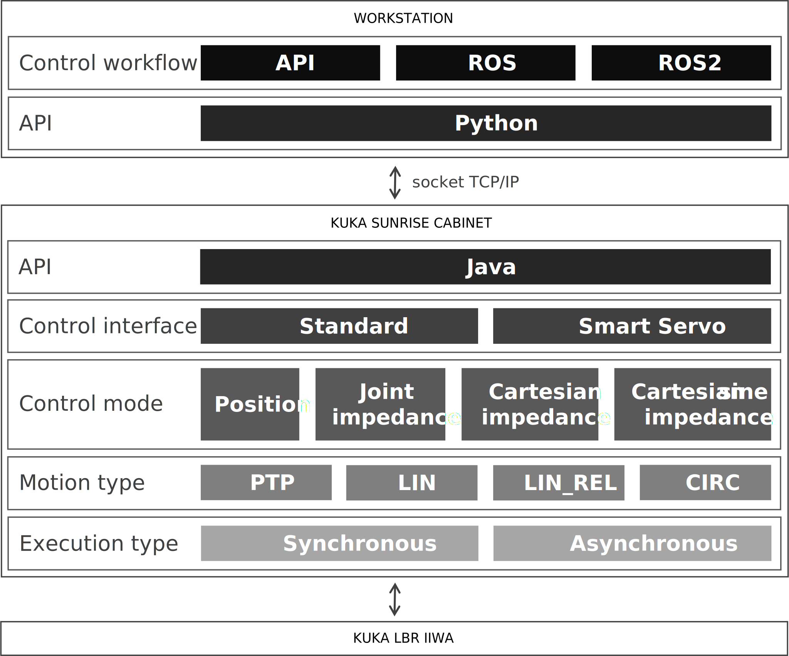

Overview
========

Framework architecture
----------------------

The image shows the architecture of the implemented framework. It is divided into three main blocks (where each block represents a physical device) as described below, from the bottom to the top block.

.. raw:: html

      

KUKA LBR iiwa
^^^^^^^^^^^^^

The sensitive lightweight robotic manipulator, which is in contact with and modifies the environment.

KUKA Sunrise Cabinet
^^^^^^^^^^^^^^^^^^^^

The robotic manipulator's controller workstation which has specific software, hardware and interfaces for controlling the latter. KUKA Sunrise.OS is the operating system of the cabinet which offers toolboxes and libraries programmed in JAVA to read and modify the robot state

One of the components implemented (**libiiwa - JAVA API**), defines an interface that uses the KUKA Sunrise.OS libraries to access most of the specific features and capabilities of this manipulator in a simple and clear way. The API allows communication and control from external stations via TCP/IP protocol. In addition, it can be used to quickly develop applications executed from the cabinet itself. The following features and capabilities of the robot can be configured and used through the API:

* Execution type: Defines how the movements of the robot will be executed by the internal real-time controller. The synchronous type executes a motion command after the current motion has been completed, blocking the program flow. The asynchronous type executes a motion command without interrupting the program
* Motion type: Defines the types of movements to be performed by the robot to go from one pose in space to another. The types supported by the implemented API are: point to point (PTP), linear (LIN), linear relative to its current position (LIN\_REL) and circular (CIRC)
* Control mode: Defines which controller can be used to operate the robot. The API allows to operate in position and impedance control mode, the latter in its different variants for Cartesian and joint control space
* Control interface: Defines which interface will be used to operate the robot controllers. The API allows to select between the two software interfaces: standard and servo (or servoing). The latter is a real-time soft interface and requires the presence of some KUKA specific libraries in the cabinet
* Conditions: Define specific reactions that terminate an active motion if limits are exceeded or not reached

Workstation
^^^^^^^^^^^

An external computer that functions as an access interface to the operator, to other external control programs such as learned or designed control policies, or to ROS/ROS2 environments, for example

External access or control workflows rely on a component of the library (**libiiwa - Python API**) programmed in Python that communicates, via TCP/IP, with its pair mentioned above (*libiiwa - JAVA API*). The supported control workflows are described in the following subsection.
