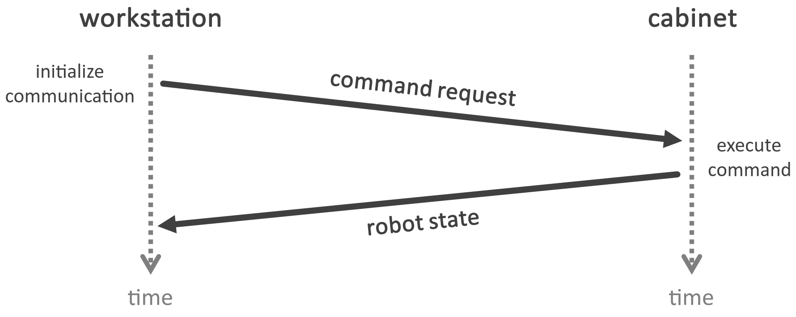

Communication protocol
======================

.. |_| unicode:: 0xA0 
    :trim:

The communication has to be initiated from the external control workstation which sends a **command request** and receives the **robot state as response**

.. raw:: html

    

Request (command)
-----------------

.. list-table::
    :header-rows: 1

    * - Command code
      - Arguments
      - Description
    * - 0
      - \-
      - Empty\ |_| \command.\ |_| \Useful\ |_| \for\ |_| \requesting\ |_| \only\ |_| \the status of the robot e.g.
    * - 
      - 
      - 
    * - 101
      - \-
      - Stop the robot motion
    * - 102
      - 7-element numeric array (axis 1 to 7)
      - Control robot using axis/joint positions (in radians). Arguments with :literal:`NaN` values will maintain their current state
    * - 103
      - 6-element numeric array (Cartesian position (3) and orientation (3))
      - Control robot using Cartesian pose (in millimeters and radians). Arguments with :literal:`NaN` values will maintain their current state
    * - 104
      - 6-element numeric array (auxiliary position (3) and end position (3))
      - Perform a circular motion (in millimeters)
    * - 
      - 
      - 
    * - 201
      - Numeric\ |_| \value\ |_| \in\ |_| \range\ |_| \[0,\ |_| \1]
      - Define the axis-specific relative velocity (% of maximum velocity)
    * - 202
      - Numeric value in range [0, 1]
      - Define the axis-specific relative acceleration (% of maximum acceleration)
    * - 203
      - Numeric value in range [0, 1]
      - Define the axis-specific relative jerk (% of maximum jerk)
    * - 204
      - Numeric value in range [0, 1]
      - Define the absolute Cartesian velocity in millimeters per second
    * - 205
      - Numeric value in range [0, 1]
      - Define the absolute Cartesian acceleration in millimeters per second squared
    * - 206
      - Numeric value in range [0, 1]
      - Define the absolute Cartesian jerk in millimeters per second cubed
    * - 
      - 
      - 
    * - 211
      - 6-element numeric array (threshold (3) in range [0, Inf) and tolerance (3) in range [0, Inf))
      - Define the force condition, in Newtons, for each Cartesian axis. Arguments with :literal:`NaN` values will not be set (or will be reset if they had any value)
    * - 212
      - Non negative integer (axis index starting at zero) and 2-element numeric array (lower and upper limits (2))
      - Define the axis/joint torque condition (lower and upper limits), in Newton-meter, for the indicated axis. Axis with :literal:`NaN` values will not be set (or will be reset if they had any value)
    * - 
      - 
      - 
    * - 221
      - 7-element numeric array (translational stiffness (3) in range [0, 5000], rotational stiffness (3) in range [0, 300], null space stiffness (1) in range [0, Inf))
      - Define the stiffness (translational stiffness in Newtons per meter, rotational stiffness in Newton-meters per radians, and spring stiffness of the redundancy degree of freedom in Newton-meters per radians) for the Cartesian impedance control
    * - 222
      - 7-element numeric array (translational damping (3) in range [0.1, 1], rotational damping (3) in range [0.1, 1], null space damping (1) in range [0.3, 1])
      - Define the damping (translational damping, rotational damping, and spring damping of the redundancy degree of freedom) for the Cartesian impedance control
    * - 223
      - 6-element numeric array (translational (3) and rotational (3) additional control forces) 
      - Define the additional control force (translational control force in Newtons and rotational control force in Newton-meter) for the Cartesian impedance control
    * - 224
      - 6-element numeric array (maximum force (3) and torque (3)) and boolean value as a number (whether to enable a stop condition)
      - Define the limitation of the maximum force (translational in Newtons) / torque (rotational in Newton-meter) on the TCP
    * - 225
      - 6-element numeric array (translational (3) in range [0, Inf) and rotational (3) in range [0, Inf))
      - Define the maximum Cartesian velocity (translational in millimeters per seconds and rotational in radians per seconds) at which motion is aborted if the limit is exceeded
    * - 226
      - 6-element numeric array (translational (3) in range [0, Inf) and rotational (3) in range [0, Inf))
      - Define the maximum permissible Cartesian path deviation (translational in millimetersand rotational in radians) at which motion is aborted if the limit is exceeded
    * - 227
      - 7-element numeric array (axis 1 to 7) in range [0, Inf)
      - Define the stiffness, in Newton-meter per radians, for joint impedance control
    * - 228
      - 7-element numeric array (axis 1 to 7) in range [0, 1]
      - Define the damping for joint impedance control 
    * - 
      - 
      - 
    * - 301
      - Enumeration value (1). See `Communication modes <#id1>`_
      - Set the communication mode
    * - 302
      - Enumeration value (1). See `Control interfaces <#id3>`_
      - Set the control interface
    * - 303
      - Enumeration value (1). See `Motion types <#id2>`_
      - Set the motion type
    * - 304
      - Enumeration value (1). See `Control modes <#id4>`_
      - Set the control mode
    * - 305
      - Enumeration value (1). See `Execution types <#id5>`_
      - Set the execution type

.. raw:: html

    

Response (robot state)
----------------------

.. list-table::
    :header-rows: 1

    * - Data
      - Description
      - Index
      - Length
      - Interpreted type
    * - :literal:`COMMAND_STATUS`
      - Whether the requested command was successfully executed or scheduled
      - 0
      - 1
      - Boolean
    * - :literal:`JOINT_POSITION`
      - Axis\ |_| \-\ |_| \specific\ |_| \actual\ |_| \position\ |_| \in radians (axis 1 to 7)
      - 1
      - 7
      - Numeric array
    * - :literal:`JOINT_VELOCITY`
      - Axis-specific computed velocity in radians per seconds (axis 1 to 7). The velocity is calculated as the difference between the reading of two consecutive positions every 10 milliseconds (100 Hz).
      - 8
      - 7
      - Numeric array
    * - :literal:`JOINT_TORQUE`
      - Measured external acting torques, in Newton-meter, without the component resulting from the weight of the robot and mass inertias during motion (axis 1 to 7)
      - 15
      - 7
      - Numeric array
    * - :literal:`CARTESIAN_POSITION`
      - End-effector Cartesian actual position in millimeters (X, Y, Z)
      - 22
      - 3
      - Numeric array
    * - :literal:`CARTESIAN_ORIENTATION`
      - End-effector Cartesian actual orientation in radians (A, B, C)
      - 25
      - 3
      - Numeric array
    * - :literal:`CARTESIAN_FORCE`
      - External Cartesian forces, in Newtons, acting on the end-effector (X, Y, Z)
      - 28
      - 3
      - Numeric array
    * - :literal:`CARTESIAN_TORQUE`
      - External Cartesian torques, in Newton-meter, acting on the end-effector (A, B, C)
      - 31
      - 3
      - Numeric array
    * - :literal:`LAST_ERROR`
      - Last registered error code. See `Errors <#id6>`_
      - 34
      - 1
      - Boolean
    * - :literal:`FIRED_CONDITION`
      - Whether motion has terminated due to a break condition
      - 35
      - 1
      - Boolean
    * - :literal:`READY_TO_MOVE`
      - Whether the robot is ready for motion. A true value does not necessarily mean that the brakes are open and that the robot is under servo control
      - 36
      - 1
      - Boolean
    * - :literal:`HAS_ACTIVE_MOTION`
      - Whether the robot is active. It does not provide any information on whether the robot is currently in motion (a false value does not necessarily mean that the robot is stationary)
      - 37
      - 1
      - Boolean

.. raw:: html

    

Enumerations
------------

Communication modes
^^^^^^^^^^^^^^^^^^^

.. warning::

    Not implemented # TODO

.. list-table::
    :header-rows: 1

    * - Code
      - Description
    * - 11
      - **On-demand**: # TODO
    * - 12
      - **Periodical**: # TODO

Motion types
^^^^^^^^^^^^

.. list-table::
    :header-rows: 1

    * - Code
      - Description
    * - 21
      - **Point-to-point motion (PTP)**: Executes a point-to-point motion to the end point
    * - 22
      - **Linear motion (LIN)**: Executes a linear motion to the end point
    * - 23
      - **Linear relative motion (LIN_REL)**: Executes a linear motion relative to the end position of the previous
    * - 24
      - **Circular motion (CIRC)**: Executes a circular motion

Control interfaces
^^^^^^^^^^^^^^^^^^

.. list-table::
    :header-rows: 1

    * - Code
      - Description
    * - 31
      - **Standard**: # TODO
    * - 32
      - **Servo motions (Servoing)**: Non-deterministic, soft real-time motions

Control modes
^^^^^^^^^^^^^

.. list-table::
    :header-rows: 1

    * - Code
      - Description
    * - 41
      - **Position controller**: Execute the specified path with the maximum possible positional accuracy and without path deviation
    * - 42
      - **Axis-specific impedance controller**: Virtual spring damper system with configurable values for stiffness and damping for each axis (joint)
    * - 43
      - **Cartesian impedance controller**: Virtual spring damper system with configurable values for stiffness and damping. This allows the robot to react in a compliant manner to external influences
    * - 44
      - **Cartesian impedance controller with overlaid force oscillation**: Special form of the Cartesian impedance controller. In addition to the compliant behavior, constant force setpoints and sinusoidal force oscillations can be overlaid

Execution types
^^^^^^^^^^^^^^^

.. list-table::
    :header-rows: 1

    * - Code
      - Description
    * - 51
      - **Asynchronous**: Next program line is executed directly after the motion command is sent (non-blocking)
    * - 52
      - **Synchronous**: Motion commands are sent in steps to the real-time controller and executed (blocking)

Errors
^^^^^^

.. list-table::
    :header-rows: 1

    * - Code
      - Description
    * - -10
      - **No error**: # TODO
    * - -11
      - **Value error**: # TODO
    * - -12
      - **Invalid joint**: # TODO
    * - -13
      - **Synchronous motion**: # TODO
    * - -14
      - **Asynchronous motion**: # TODO
    * - -15
      - **Validation for impedance**: # TODO
    * - -16
      - **Invalid configuration**: # TODO
